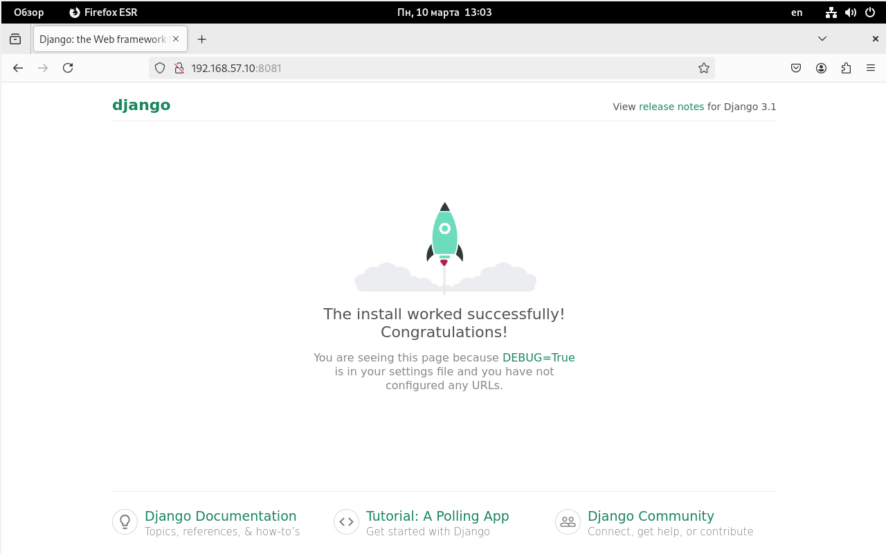
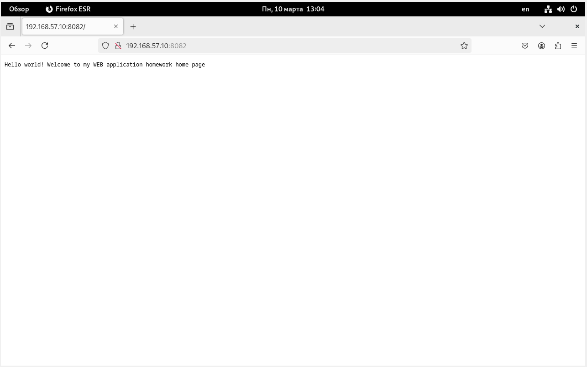
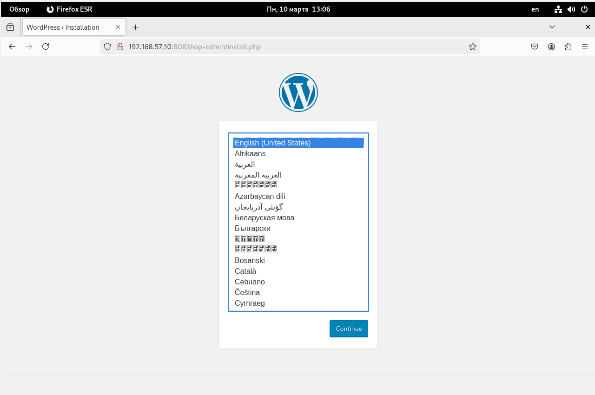
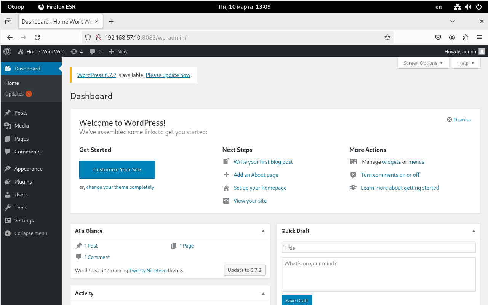
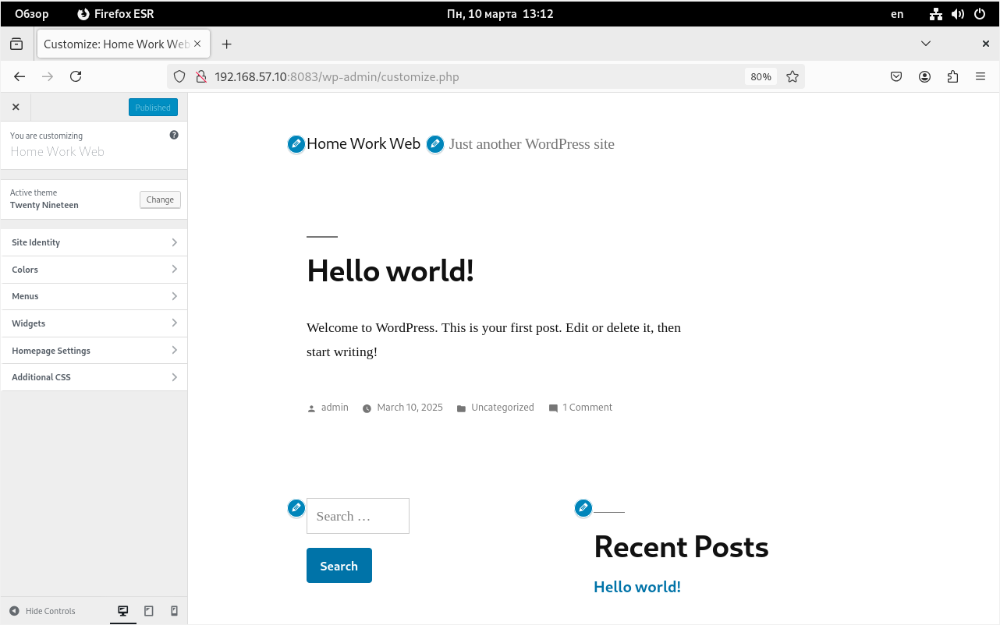

# Vagrant-стенд c развертыванием веб приложения


### Цель домашнего задания
Получить практические навыки в настройке инфраструктуры с помощью манифестов и конфигураций. Отточить навыки использования ansible/vagrant/docker.

### Описание домашнего задания
  
Варианты стенда:    
nginx + php-fpm (laravel/wordpress) + python (flask/django) + js(react/angular);    
nginx + java (tomcat/jetty/netty) + go + ruby;     
можно свои комбинации.    

Реализации на выбор:    
на хостовой системе через конфиги в /etc;     
деплой через docker-compose.    
Для усложнения можно попросить проекты у коллег с курсов по разработке     
К сдаче принимается:     
vagrant стэнд с проброшенными на локалхост портами     
каждый порт на свой сайт     
через нжинкс      
    
Формат сдачи ДЗ - vagrant + ansible      

### Введение
За последние десятилетия, средняя скорость разработки увеличивается с большой прогрессией от года к году, потому что IT продукты приносят огромные деньги бизнесу практически в любой сфере. Высокая интенсивность породила большое количество методологий, ускоряющих разработку. Также выросли требования к инфраструктуре. Появилась необходимость динамически обновлять, откатывать, масштабировать и резервировать нашу инфраструктуру. В нынешних реалиях, одной из ключевых методологий в построении информационных систем, является - Infrastructure as Code ( Инфраструктура как код, IaC ). Она подразумевает подход для управления и описания инфраструктуры ЦОД через конфигурационные файлы, а не через ручное редактирование конфигураций на серверах или интерактивное взаимодействие. Этот подход может включать в себя как декларативный способ описания инфраструктуры, так и через скрипты.    

IaC несёт в себе следующие плюсы:   
Скорость и уменьшение затрат    
Масштабируемость и стандартизация    
Безопасность и документация     
Восстановление в аварийных ситуациях     

P.S. Подробнее про IaC, вы можете почитать в нашей статье - https://habr.com/ru/company/otus/blog/574278/     
     
     
## Выполнение    
### 1.  С помощью vagrant развернул машину:    

| Имя          | IP-адрес       |  OS   |
|-------------|---------------|-----------|
| DynamicWeb  | 192.168.57.10  |  bento/ubuntu-22.04  |  


### 2. Создал ansible playbook и роли    
Запустил playbook    
```shell
root@ansible:/home/vagrant/ansible# ansible-playbook web.yml

PLAY [DynamicWeb] ***********************************************************************************************
...
PLAY RECAP ******************************************************************************************************
192.168.57.10              : ok=11   changed=4    unreachable=0    failed=0    skipped=0    rescued=0    ignored=0
```   
Playbook отработал без ошибок    

### 3. Далее проверяю результат правильной раскатки playbook   

С хостовой машины стучусь на 1 порт http://192.168.57.10:8081    

    

django работает    

Теперь стучусь на 2 порт http://192.168.57.10:8082    

    

Контейнер node работает    

Далее стучусь на 3 порт http://192.168.57.10:8083     



    



WordPress работает

____________________________________________________________________     
end


